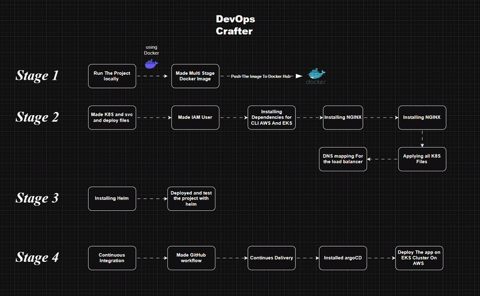
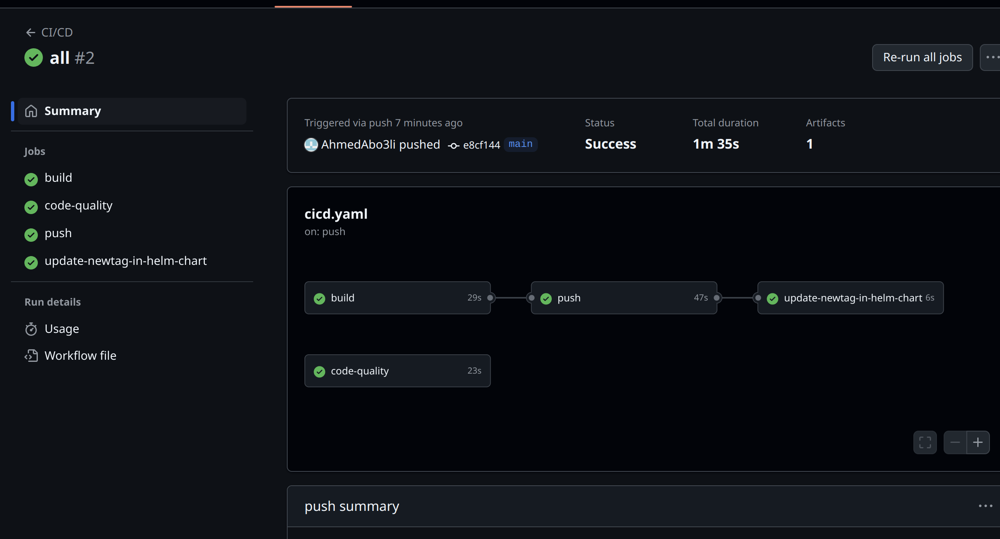
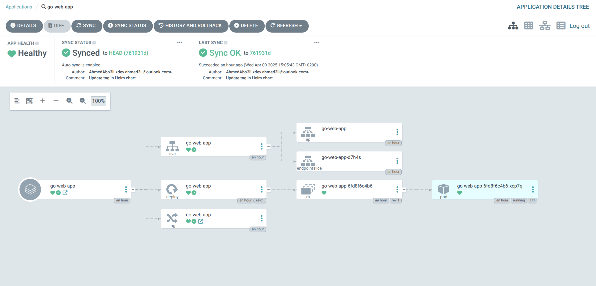

# DevOps Portfolio – CV Deployment on AWS EKS

This project represents my personal CV deployed as a production-grade web application using modern DevOps tools and practices. It demonstrates my experience with containerization, infrastructure automation, and continuous deployment on AWS.

---

## Overview

The goal of this project was to host my CV on a resilient, scalable infrastructure using:
- **AWS EKS (Elastic Kubernetes Service)**
- **Helm for Kubernetes packaging**
- **GitHub Actions for CI/CD**
- **Argo CD for GitOps delivery**
- **NGINX Ingress + Route53 DNS**

This setup mimics a real-world cloud-native deployment pipeline from development to production.

---

## Technology Stack

- **AWS EKS** – Kubernetes cluster hosting
- **Docker** – Multi-stage image builds  
- **Helm** – Kubernetes templating and deployment
- **GitHub Actions** – CI/CD pipeline automation  
- **Argo CD** – Continuous delivery via GitOps
- **NGINX Ingress** – External access routing  
- **Route53** – DNS mapping

---

## Project Workflow

The following diagram summarizes the project in three phases:



---

## Phase 1 – Containerization

- Developed and tested the project locally.
- Created an optimized **multi-stage Dockerfile**.
- Pushed the image to **Docker Hub**.


---

## Phase 2 – Kubernetes & AWS Setup

- Wrote Kubernetes **deployment**, **service**, and **ingress** manifests.
- Configured an **IAM user** for programmatic access.
- Installed necessary tools: `aws-cli`, `eksctl`, and `kubectl`.
- Created and configured an **EKS Cluster**.
- Deployed **NGINX Ingress Controller** for traffic routing.
- Applied all Kubernetes manifests.
- Mapped domain using **Route53** for DNS.
  
  


---

## Phase 3 – Helm & GitOps

- Installed **Helm** and converted raw K8s manifests to a Helm chart.
- Used **Argo CD** to sync the Helm chart from GitHub to the cluster.
- Created a GitHub Actions workflow for CI/CD:
  - Linting and building Docker images
  - Pushing to Docker Hub
  - Triggering Argo CD sync

---

## CI/CD Pipeline (GitHub Actions)



> Each commit triggers automated build, test, and deploy.

---

## Continuous Delivery with Argo CD



> Argo CD ensures the live state always matches the declared Git state.

---

## Repository Structure

```
.
├── Dockerfile
├── helm-chart/
│   ├── templates/
│   └── values.yaml
├── k8s/
│   ├── deployment.yaml
│   ├── service.yaml
│   └── ingress.yaml
├── .github/
│   └── workflows/
│       └── ci-cd.yml
├── assets/
│   ├── demo.gif
│   ├── docker.png
│   ├── cicd.png
│   └── argocd.png
└── README.md
```
